<div align="center">

</div>

<br/>

<div align="center">

</div>

<br/><br/>

## About


<br/>

## Tech Stack



<br/>

## Skills



<br/>

## Experience Timeline



<br/>

## Dashboard



<br/>

## Featured Projects


<br/>

## GitHub Stats

<p align="center">


</p>

<p align="center">

</p>

<blockquote>
Replace <code>zeeshanhaider</code> in the URLs above with your real GitHub username, or these will 404.
</blockquote>

<br/>

## Contribution Snake

<p align="center">

</p>

<details>
<summary>GitHub Action to generate this (add as <code>.github/workflows/snake.yml</code>)</summary>

```yaml
name: snake
on:
  schedule: [{cron: "0 0 * * *"}]
  workflow_dispatch:
jobs:
  build:
    runs-on: ubuntu-latest
    steps:
      - uses: Platane/snk@v3
        with:
          github_user_name: ${{ github.repository_owner }}
          outputs: dist/snake-dark.svg?palette=github-dark
      - uses: crazy-max/ghaction-github-pages@v3
        with:
          target_branch: output
          build_dir: dist
        env:
          GITHUB_TOKEN: ${{ secrets.GITHUB_TOKEN }}
```

</details>

<br/>

## Metrics

<p align="center">

</p>

<br/>

<div align="center">

</div>
